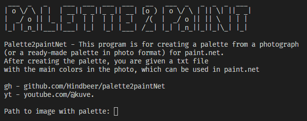
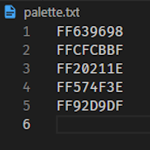

# Palette2paintNet
Palette2paintNet - This program is for creating a palette from a photograph (or a ready-made palette in photo format) for paint.net.After creating the palette, you are given a txt file with the main colors in the photo, which can be used in paint.net
## For installation
Для работы нужен [Python3](https://www.python.org), библиотека `colorthief` и `pillow` для работы первой
```
pip3 install -r requirements.txt
```
For better performance, create a separate virtual environment
## How to use
The main file is `main.py` 



After launch, you will be asked to enter the path to the desired image from which you want to make a palette, and then the number of colors in this palette (from 0 to infinity)
## Example (`color_count = 5`)
|  |  | 
| - | - | - |
## Links
[youtube](https://youtube.com/@kuve.) [telegram](https://t.me/fancy_kuve) 